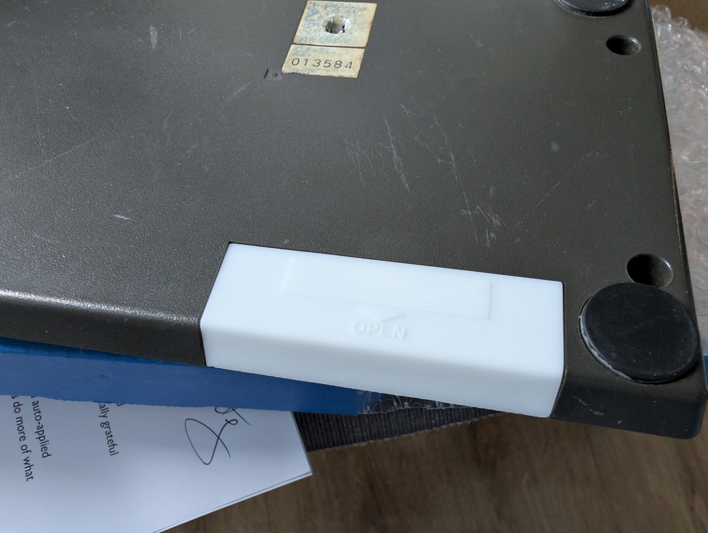
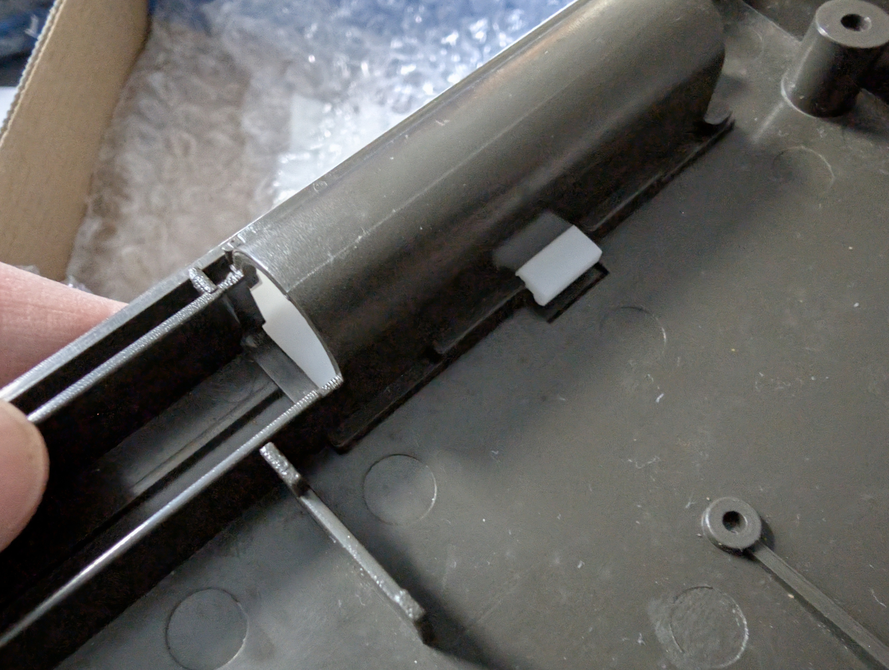

# XE-1 Pro Battery Door

Replacement battery door for the Micomsoft XE-1 Pro joystick.

  

I had these 3D printed by JLCPCB in 9600 Resin with the SLA process, and the friction fit is good. The clip needs to be a little bit thicker but is adequate.
